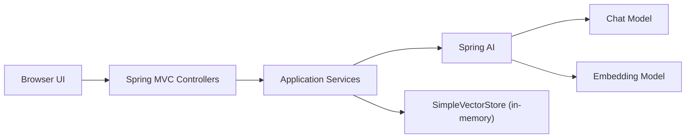
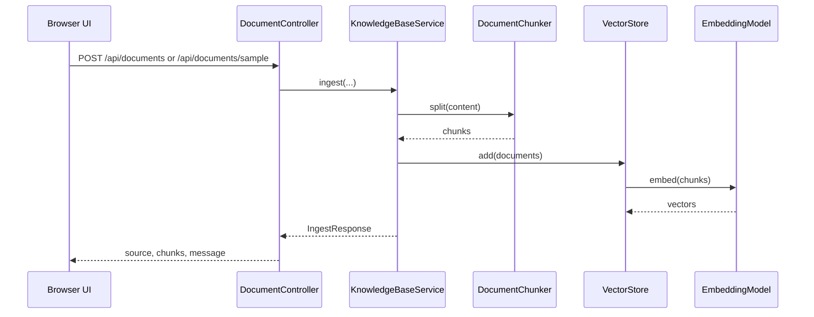
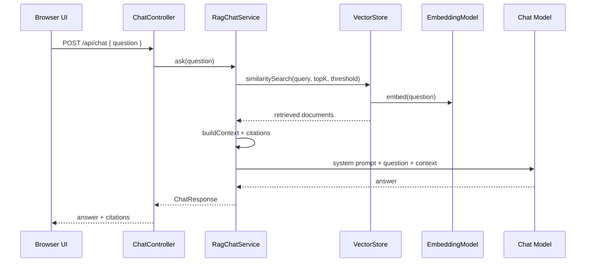

# 架构说明

## 目标定位

Enterprise RAG Demo 是一个面向 Java 工程师学习 AI 应用开发的 Spring Boot + Spring AI MVP。它用最少的模块展示企业知识库问答的核心架构：知识导入、Embedding、向量检索、Prompt 约束、大模型生成和引用返回。

## 技术栈

- Java 17
- Spring Boot 3.5.7
- Spring AI 1.1.4
- Groq Chat Model
- 智谱 AI Embedding Model
- Spring AI `SimpleVectorStore`
- 原生 HTML/CSS/JavaScript 前端
- JUnit 5 + AssertJ 单元测试

## 系统边界

系统内部负责：

- 接收用户上传的 Markdown/TXT 文档。
- 将文档切分成可检索片段。
- 调用 Embedding Model 生成向量并写入向量库。
- 根据用户问题执行向量相似度检索。
- 将检索片段组装成受约束的 Prompt。
- 调用 Chat Model 生成回答并返回引用。
- 使用外部评测集和参数矩阵做检索评测。

系统外部依赖：

- Groq OpenAI 兼容 Chat API。
- 智谱 AI OpenAI 兼容 Embedding API。
- 浏览器访问本地静态页面。

## 模块职责

| 模块 | 路径 | 职责 |
| --- | --- | --- |
| 应用入口 | `EnterpriseRagDemoApplication` | 启动 Spring Boot 应用 |
| AI 配置 | `config/AiConfig` | 构建 `ChatClient` 和内存 `VectorStore` |
| 文档控制器 | `controller/DocumentController` | 上传文档、导入样例、查询已导入文档 |
| 问答控制器 | `controller/ChatController` | 接收问题并返回 RAG 回答 |
| 评测控制器 | `controller/EvalController` | 解析评测参数矩阵并返回评测报告 |
| 异常处理 | `controller/ApiExceptionHandler` | 统一返回错误消息 |
| 文档切分 | `service/DocumentChunker` | 文本规范化、按段落/句子优先切片、保留 overlap |
| 知识库服务 | `service/KnowledgeBaseService` | 文档校验、切片、metadata 构造、向量入库 |
| RAG 问答服务 | `service/RagChatService` | 检索、Prompt 组装、大模型调用、引用生成 |
| 评测用例加载 | `service/EvalCaseLoader` | 从 `eval-cases.json` 加载并校验评测集 |
| 评测服务 | `service/EvalService` | 用期望关键词和来源检查检索结果，并聚合评测报告 |
| DTO | `dto/*` | API 请求响应结构 |
| 前端 | `src/main/resources/static/*` | 上传、样例导入、提问、评测展示 |

## 运行时请求链路

### 文档导入

### RAG 问答

## 当前架构取舍

| 设计点 | 当前选择 | 适用原因 | 局限 |
| --- | --- | --- | --- |
| 向量库 | `SimpleVectorStore` 内存存储 | 零基础设施，适合 MVP 学习 | 重启后数据丢失，无法多实例共享 |
| Chat Model | Groq `llama-3.3-70b-versatile` | OpenAI 兼容接口，低延迟，适合体验问答生成 | 需要单独配置 Groq API Key |
| Embedding Model | 智谱 AI `embedding-3` | OpenAI 兼容接口，替换原 OpenAI Embedding | 需要关注向量维度、成本和限流 |
| 文档格式 | `.md` / `.txt` | 简化解析，聚焦 RAG 主链路 | 不支持 PDF、Word、图片 OCR |
| 切分策略 | 固定长度 + overlap + 可读断点 | 易理解，适合制度文档 | 缺少语义切分和标题层级保留 |
| 评测方式 | 外部评测集 + 关键词/来源命中 + 参数矩阵 | 验证检索是否能命中关键信息，并比较不同参数组合 | 不能自动衡量生成质量、忠实度、成本和延迟 |
| Prompt | system prompt 强约束 | 降低幻觉，要求引用 | 未做模板版本管理和 A/B 对比 |
