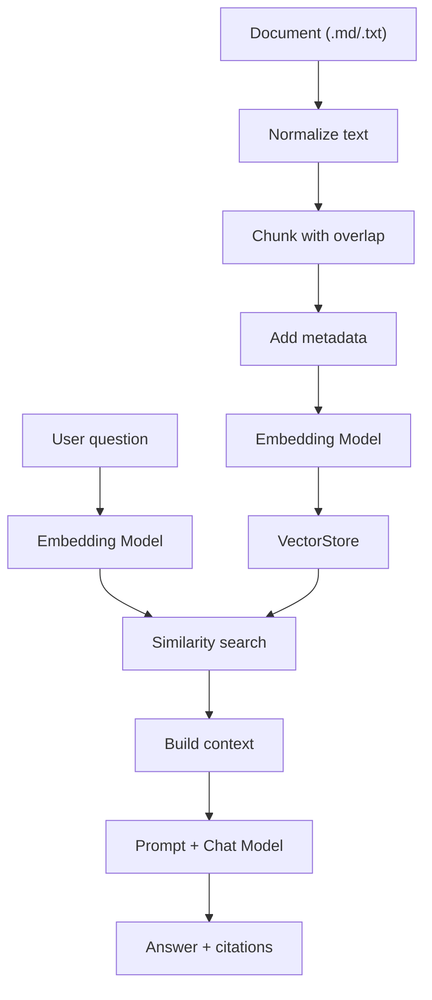

# RAG 实现原理

## RAG 主流程

RAG 的核心是先检索、再生成。当前项目将企业制度文档转成向量片段，用户提问时先从知识库中找相关片段，再把这些片段作为上下文交给大模型回答。



## 文档切分

实现位置：`src/main/java/com/example/enterpriserag/service/DocumentChunker.java`

默认参数：

- `DEFAULT_CHUNK_SIZE = 900`
- `DEFAULT_OVERLAP = 120`

处理步骤：

1. 将 Windows/Mac 换行统一成 `\n`。
2. 压缩连续空格和制表符。
3. 将 3 个以上连续空行压缩成 2 个换行。
4. 按最大长度切片。
5. 优先在段落、句号或换行位置截断，避免把一句话硬切开。
6. 下一个片段从 `end - overlap` 开始，保留上下文连续性。

这个策略的价值是易懂、稳定、适合制度类文本。局限是没有保留 Markdown 标题层级，也没有按语义边界做自适应切分。

## 向量入库

实现位置：`src/main/java/com/example/enterpriserag/service/KnowledgeBaseService.java`

导入入口：

- `POST /api/documents`
- `POST /api/documents/sample`

入库逻辑：

1. 校验文件名，只允许 `.txt` 和 `.md`。
2. 使用 UTF-8 读取文件内容。
3. 调用 `DocumentChunker.split` 得到片段列表。
4. 为每个片段构造 Spring AI `Document`。
5. 写入 metadata：
   - `source`：来源文件名。
   - `chunk`：片段编号，从 1 开始。
   - `indexedAt`：索引时间。
6. 调用 `vectorStore.add(documents)`。

`VectorStore` 当前由 `AiConfig` 创建为 `SimpleVectorStore`。它会在添加文档时通过 Spring AI 的 `EmbeddingModel` 生成向量。

当前项目使用 Groq Chat Model 和智谱 AI Embedding Model。Groq 用于检索完成后的回答生成；智谱 Embedding 用于导入文档和检索问题时的向量化，因此需要同时配置 `GROQ_API_KEY`、`GROQ_CHAT_MODEL`、`ZAI_API_KEY` 和 `ZAI_EMBEDDING_MODEL`。

## 检索策略

实现位置：`src/main/java/com/example/enterpriserag/service/RagChatService.java`

检索参数来自 `application.yml`：

```yaml
app:
  rag:
    top-k: 4
    similarity-threshold: 0.0
```

检索逻辑：

```java
SearchRequest request = SearchRequest.builder()
        .query(question)
        .topK(topK)
        .similarityThreshold(similarityThreshold)
        .build();
return vectorStore.similaritySearch(request);
```

含义：

- `topK` 控制最多取回多少个片段。
- `similarityThreshold` 控制最低相似度门槛。不同 Embedding 模型的分数分布不同，MVP 默认设为 `0.0`，先保证能召回结果，再通过评测逐步调高。
- 如果没有命中片段，系统直接返回“知识库里没有检索到足够相关的资料”，不调用 Chat Model。

## Prompt 设计

RAG 回答使用两段输入：

1. system prompt：定义助手角色、回答边界和引用要求。
2. user prompt：包含用户问题和检索到的知识库片段。

system prompt 的关键约束：

- 严格基于知识库片段回答。
- 片段中没有答案时，回答“根据当前知识库无法确认”。
- 回答适合企业员工阅读。
- 最后必须列出“引用：”，格式为 `来源文件#片段编号`。

这类约束是企业 RAG 的基础防幻觉策略。它不能完全消除幻觉，但能明显降低模型越界回答的概率，并让用户看到答案来源。

## 上下文组装

实现方法：`buildContext`

每个片段会被格式化为：

```text
[source#chunk]
chunk text
```

片段之间使用分隔线：

```text
---
```

这样做的目的是让模型能够区分不同来源片段，并在回答中引用对应编号。

## 引用返回

服务端返回的 `ChatResponse` 包含：

- `answer`：模型生成的答案。
- `citations`：服务端根据检索结果生成的引用数组。

每个引用包含：

- `source`：来源文件。
- `chunk`：片段编号。
- `preview`：片段预览，最多 120 个字符。

注意：当前项目返回的引用来自检索结果，不是模型自己声明的引用解析结果。这样可以保证前端展示的引用一定来自检索链路。

## 最小评测

实现位置：`src/main/java/com/example/enterpriserag/service/EvalService.java`

当前评测集：

| 问题 | 期望关键词 |
| --- | --- |
| 试用期请假会影响转正吗？ | 转正 |
| 报销发票最晚什么时候提交？ | 30 |
| 年假没休完怎么处理？ | 结转 |
| 远程办公需要提前多久申请？ | 1 |

评测逻辑：

1. 对每个问题执行检索。
2. 检查任一命中文档片段是否包含期望关键词。
3. 返回是否通过和命中片段引用。

这是检索层的 smoke test，用来确认知识库导入和相似度检索大体可用。它还不是完整 RAG 评测，无法覆盖：

- 回答是否忠实。
- 引用是否准确。
- 是否存在遗漏召回。
- 不同模型、topK、阈值的对比效果。
